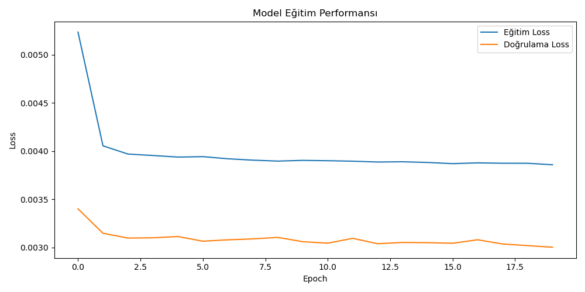

🔍 Model Prediction Result

The following plot compares the model’s predicted and actual hourly energy consumption over the first 100 hours of the dataset.

📊 Evaluation Metric: Mean Squared Error (MSE) was used to evaluate model performance.

This output demonstrates that the LSTM model successfully captures time-based patterns in energy usage.  
Such forecasting is essential for:
- ⚡ Smart grid management
- 🕒 Real-time energy optimization
- 💸 Reducing operational costs through predictive insights


📉 Validation vs Training Loss
The graph below illustrates the training and validation loss throughout the model’s learning process.

It helps assess:

- Model convergence and stability
- Potential overfitting or underfitting
- Generalization ability on unseen data


💾 Trained Model

The trained LSTM model has been saved as:

`wattwatcher_model.h5`

You can reuse this model without retraining by loading it as follows:

`python
from tensorflow.keras.models import load_model

# Load the pre-trained model
model = load_model("wattwatcher_model.h5")
```

This allows you to make predictions on new energy consumption data directly.

