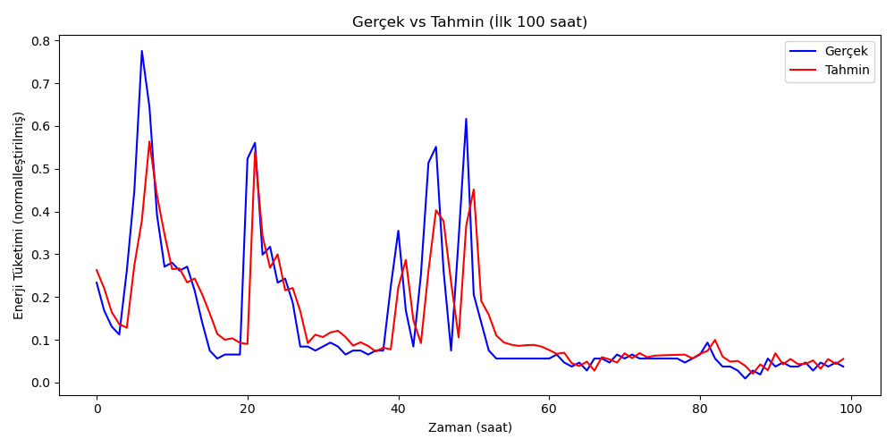

🔍 Model Prediction Result

The following plot compares the model’s predicted and actual hourly energy consumption over the first 100 hours of the dataset.

📊 Evaluation Metric: Mean Squared Error (MSE) was used to evaluate model performance.

This output demonstrates that the LSTM model successfully captures time-based patterns in energy usage.  
Such forecasting is essential for:
- ⚡ Smart grid management
- 🕒 Real-time energy optimization
- 💸 Reducing operational costs through predictive insights

